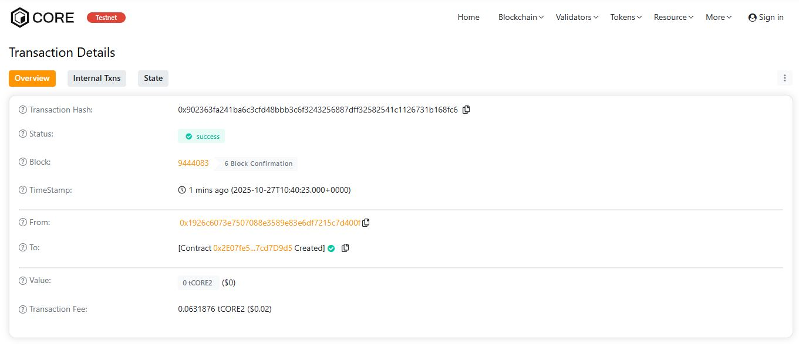

# BlockNovaChain

## 🧩 Project Description
**BlockNovaChain** is a decentralized blockchain-based ledger designed to record, verify, and retrieve immutable data entries.  
It provides a transparent and tamper-proof system where every record is timestamped and associated with its creator, ensuring authenticity and traceability.

---

## 🌐 Project Vision
To build a **transparent, secure, and immutable blockchain record-keeping platform** that can be used across industries for data integrity, auditing, and digital notarization.

---

## 🔑 Key Features
- **Immutable Records:** Once stored, data cannot be modified or deleted.  
- **Timestamped Entries:** Each record includes the exact time of creation.  
- **User Transparency:** Each record is linked to the creator’s address.  
- **Simple Verification:** Anyone can retrieve and verify stored data.  
- **Event Logs:** All record creations are emitted as blockchain events for external tracking.

---

## 🔭 Future Scope
- **Integration with IPFS** to store large datasets or documents.  
- **Access Control Layers** for enterprise and permissioned systems.  
- **NFT-based Ownership Proofs** for data certification.  
- **Web Dashboard** for real-time record visualization.  
- **Cross-chain Data Anchoring** for multichain interoperability.

---

## ⚙️ Tech Stack
- **Solidity (v0.8.x)**  
- **Hardhat** (development & testing)  
- **Ethers.js** (interaction)  
- **Ethereum / EVM-compatible networks**

---

## 📄 License
MIT License © 2025 BlockNovaChain

H address:0x902363fa241ba6c3cfd48bbb3c6f3243256887dff32582541c1126731b168fc6

